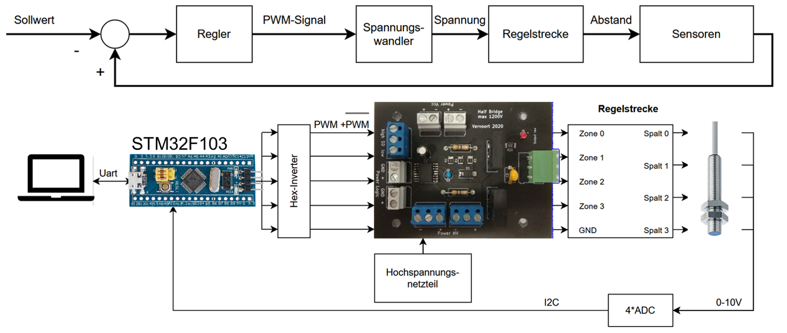
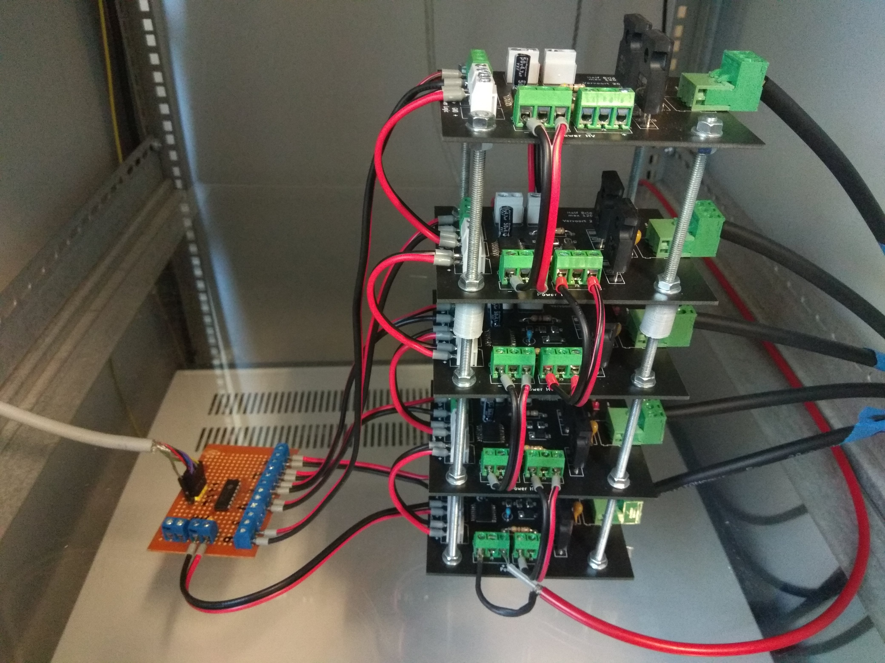
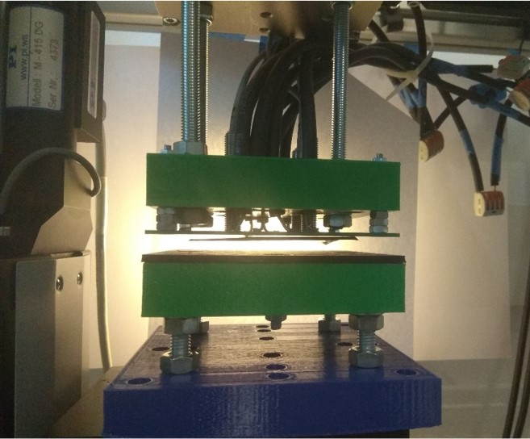

# Kontaktloser Elektrostatischer Greifer

Dieses Projekt ist im Zuge meines Studiums entstanden. Ziel war es, einen Greifer zur Handhabung von dünnen (<20um) Lithiumfolie zu entwickeln. Problematisch bei Lithium ist, dass das Material sehr reaktiv und empfindlich ist. Die Handhabung findet daher meistens in einer Schutzgasatmosphäre wie Argon statt.Pneumatischen Greifer, wie Flächensauggreifer, die gerne in der Folienhandhabung genutzt werden, sind daher problematisch, da als Prozessmedium ebenfalls das SChutzgas genutzt werden müsste. Zudem besteht beim Einsatz von Pneumatik die Gefahr der Kontamination der Folie mit Patikeln aus der Umgebung. Eine Lösung sind daher Elektrostatische Greifer.

Bei Interesse kann ich dir meine komplette Ausarbeitung zukommen lassen.

## Funktionsprinzip

Der kontaktlose Greifer ist eine Weiterentwicklung des in .... vorgestellten Elektrostatischen Greifers. Es kommt allerdings ein Eelktrodesign mit vier Zonen mit jeweils einem konzentrischen Elektrodenpaare zum Einsatz. Im Zentrum jedes Paares befindet sich ein Abstandssensor, der den Abstand zwischen Greifer und der zu handhabenden Folie misst. 

Die Spannung der einzelnen Zonen wird (max 1000V) wird nun in Abhängigkeit des gemessenen Abstands so geregelt, dass sich die anziehenden Elektrostatischen Kräfte und die Schwerkraft in Waage halten.

## Umsetzung

Basis des Aufbaus bildet ein STM32F103 (Bluepill) Mikrocontroller der die Abstandswerte verabeitet und mittles PID Regler die enstsprechenden Zonenspannungen berechnet. Die Erzeugung notwendigen Spannung zwischen 0 und 1000V erfolgt über eine speziell für den Einsatzzweck entworfenen Schaltung basierend auf dem Halbbrückentreiber "FAN73912mx" (Dokumentation folgt). Als Abstandssensoren wurde die Induktiven Sensoren 
"DWAD 509 M8 390" mit einem Messbereich von 0 bis 4 mm und einem anlogen Ausgang gewählt. Die AD Wandlung übernehmen vier ADS1115, die mittels I2C an den Mikrocontroller angebunden sind. Da die Abstandssensoren kein lineares Spannungssignal liefern, müssen sie vom Mikrocontroller mittels Kalibrierdaten (Messen von Spannung über Abstand mit einer PI Linearachse mit einer Genauigkeit von 0,1 μm als Referenz) linearisiert.

Als Userinterface dient auf eine [Python-Gui](https://github.com/Fersaar/Leviosa_Python_GUI), die auf einem Computer läuft und zur Visualisierung der Mess- und Regelsignale sowie zum Einstellen der Parameter dient. Die Kmmunikation mit dem Mikrocontroller erfolgt über eine Serielle Schnitstelle.

 

|  |   |
|--|---|
| | |
|Halbbrücken |Mikrocontroller und AD Wandler |

## Praxis
In der Realität sieht das dann wie folgt aus. Links ist der Greifer mit der schwebenden Folie zu sehen, rechts die dazu entsprechenden Mess- und Regelwerte.

|  |   |
|--|---|
| | |
|Schwebende Folie |Python Oberfläche |
