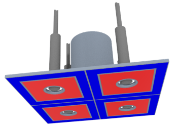
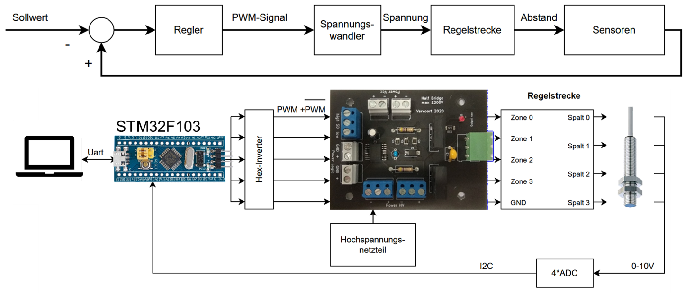
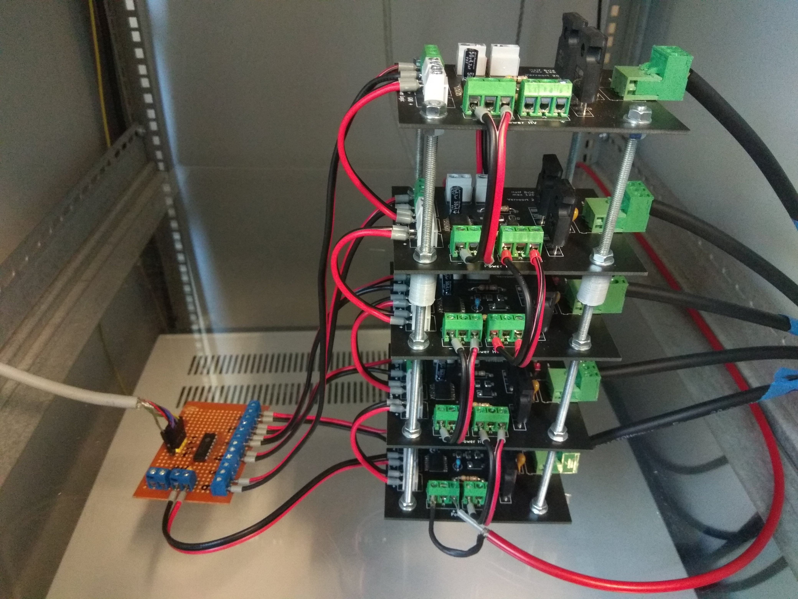
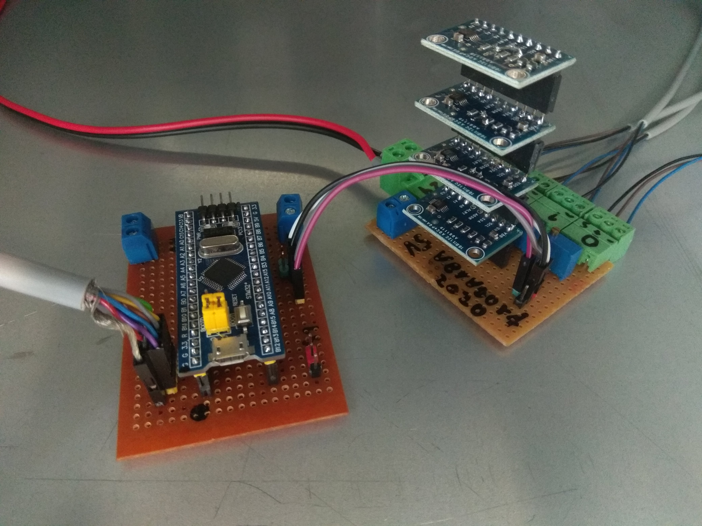
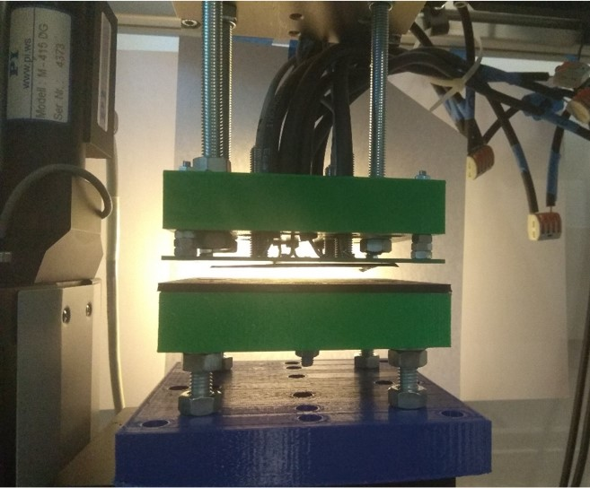
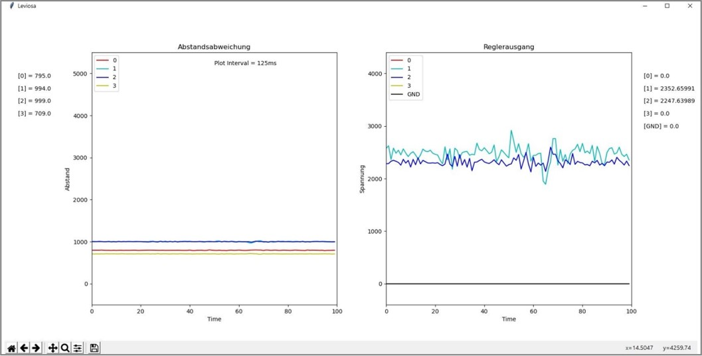

# Contactless Electrostatic Gripper

This project was developed in the course of my studies. The goal was to develop a gripper for handling thin (<20um) lithium foil. The problem with lithium is that the material is very reactive and sensitive. Pneumatic grippers, such as large-area suction pads, which are often used in film handling, are therefore problematic because the inert gas would also have to be used as the process medium. In addition, when using pneumatics, there is a risk of contaminating the film with paticles from the environment. Electrostatic grippers are therefore a solution.

If you are interested, I can send you my complete elaboration.

## Functional principle

The contactless gripper is a further development of the electrostatic gripper presented in ..... However, it uses an eelctro design with four zones, each with a concentric pair of electrodes. At the center of each pair is a distance sensor that measures the distance between the gripper and the film being handled. 

The voltage of the individual zones (max 1000V) is now regulated in dependence of the measured distance in such a way that the attracting electrostatic forces and the gravity keep themselves in balance.

## Implementation

The basis of the setup is a STM32F103 (Bluepill) microcontroller which processes the distance values and calculates the corresponding zone voltages using a PID controller. The necessary voltage between 0 and 1000V is generated by a special designed circuit based on the half bridge driver "FAN73912mx" (Documentation in progress). As distance sensors the inductive sensors 
"DWAD 509 M8 390" with a measuring range of 0 to 4 mm and an analog output were chosen. The AD conversion is done by four ADS1115, which are connected to the microcontroller via I2C. Since the distance sensors do not provide a linear voltage signal, they must be linearized by the microcontroller using calibration data (measuring voltage over distance with a PI linear axis with an accuracy of 0.1 μm as a reference).

The user interface is a [Python-Gui](https://github.com/Fersaar/Leviosa_Python_GUI), which runs on a computer and is used to visualize the measurement and control signals and to set the parameters. The Kmmunikation with the microcontroller takes place over a serial interface.

 

| | |
|--|---|
| | |
|Halfbridges |Microcontroller and AD converter |

 

## Experiment

In reality, this looks as follows. On the left is the gripper with the floating film, on the right the corresponding measurement and control values.

 

| | |
|--|---|
| | |
|Levitating Foil |Python Surface |
